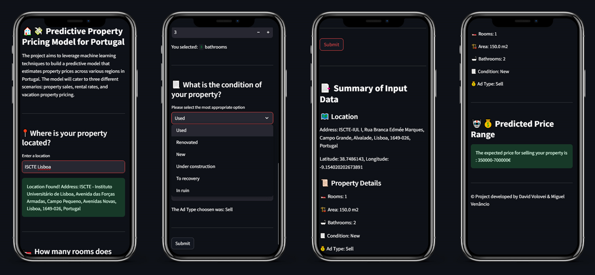

    

# PredictivePropertyPricing
The project aims to leverage machine learning techniques to build a predictive model that estimates property prices across various regions in Portugal. The model will cater to three different scenarios: property sales, rental rates, and vacation property pricing.
